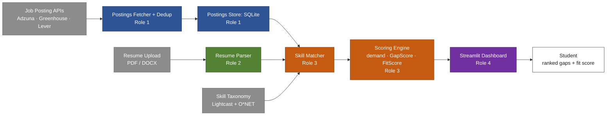

# Job Posting Skills Gap Analyzer  SparkNotes

> [!summary]
> Take a resume + a target role pull real job postings for that role  mine the skills those postings actually ask for show what's ==missing== and how in-demand it is. Team of 4. Runs on free APIs, $0–19/mo.

## Implementation status (prototype)

- **Pipeline:** Adzuna, Greenhouse, and Lever clients, posting normalization,
  deduplication, and SQLite storage are implemented. Live use requires API
  credentials and/or configured company boards.
- **Resume ingestion:** PDF/DOCX parsing, section extraction, and experience
  date extraction are implemented. Direct Google Docs, plain-text, and JSON
  uploads are not implemented.
- **Scoring:** a curated starter taxonomy matcher, posting demand, Wilson
  intervals, recency and required/preferred weighting, GapScore, cosine
  FitScore, and per-skill dated experience evidence are implemented.
- **Dashboard:** role selection, resume upload, posting fetch/view, score
  display, recommendations, and experimental related-posting text search are
  wired end to end.

The taxonomy is deliberately small and the automated examples use synthetic
Adzuna/Greenhouse-shaped postings. Treat the scores as illustrative until the
taxonomy and scoring behavior have been evaluated against real, representative
posting samples. See [TEAM_HANDOFF.md](TEAM_HANDOFF.md) for implementation
details and remaining work.

## Architecture

**Color = owning role.** Gray = external/input, blue = Role 1, green = Role 2, orange = Role 3, purple = Role 4. SUBJECT TO CHANGE\

write or find specifc code. for reading pdf, word, google docs.

## Pipeline

1. **Collect postings**: pull a sample for the target role from job APIs / ATS feeds
2. **Read the resume**: parse uploaded PDF/DOCX into plain text
3. **Extract skills**" match text against one shared skill taxonomy ("JS" = "JavaScript")
4. **Score demand**:  how often each skill shows up, weighted by recency + required-vs-preferred
5. **Score the gap**: resume skills vs. demand profile ranked gaps + fit score

## Data Sources

| Source                       | Gives you                            | Cost                       |
| ---------------------------- | ------------------------------------ | -------------------------- |
| Adzuna API                   | Aggregated postings, Canada coverage | Free (~1,000 calls/mo)     |
| Greenhouse Job Board API     | Full posting text, per named company | Free, no key               |
| Lever Postings API           | Full posting text, per named company | Free, no key               |
| Lightcast Open Skills        | 35k+ skill taxonomy                  | Free (register)            |
| O\*NET                       | Occupation - skill baseline          | Free                       |
| Kaggle resume datasets       | Dev/test resumes                     | Free                       |
| JSearch (RapidAPI)  optional | Backup aggregator                    | Free tier, then ~$10-19/mo |

Resumes: real input is student file upload. No usable LinkedIn API — point students to LinkedIn's own "Save to PDF" export instead.

> [!tip]+ Key technique: Formatting & normalization
> Greenhouse/Lever return HTML-escaped text, Adzuna returns truncated excerpts, resumes are PDF/DOCX binaries. All of it gets stripped to clean plain text ==before== the skill matcher touches it. Inconsistent formatting upstream is the #1 cause of missed matches downstream ---- test this early.

## Math

Let $N$ = postings pulled for a role, $x$ = postings mentioning skill $s$.

**Demand** (sample proportion report with a confidence interval, not bare):
$$\text{demand}(s) = \frac{x}{N}$$

**95% Wilson score interval** (small $N$ from free-tier APIs makes this necessary):
$$\hat{p} = \frac{x}{N}, \quad z = 1.96$$
$$\text{center} = \frac{\hat{p} + \dfrac{z^2}{2N}}{1 + \dfrac{z^2}{N}} \qquad \text{margin} = \frac{z\sqrt{\dfrac{\hat{p}(1-\hat{p})}{N} + \dfrac{z^2}{4N^2}}}{1 + \dfrac{z^2}{N}}$$

**Weighted demand** (recency: <30d = 1.0, 30–90d = 0.7, >90d = 0.4 · requirement: required = 1.0, preferred = 0.5):
$$\text{weighted\_demand}(s) = \frac{\sum_{p} w(p) \cdot \mathbb{1}[s \in p]}{\sum_{p} w(p)}$$

**Gap score** (what to learn next) and its mirror (existing strengths, has(s)=1):
$$\text{GapScore}(s) = \text{weighted\_demand}(s) \times (1 - \text{has}(s))$$

**Fit score** (cosine similarity, resume vector $\vec{r}$ vs. role demand vector $\vec{d}$):
$$\text{FitScore} = \frac{\vec{r} \cdot \vec{d}}{\|\vec{r}\|\,\|\vec{d}\|} \;\rightarrow\; \text{shown as } 0\text{–}100\%$$

## Tech Stack

| Layer | Tool |
|---|---|
| Backend | Python + Flask / FastAPI |
| Resume parsing | [pdfplumber](https://github.com/jsvine/pdfplumber), [python-docx](https://github.com/python-openxml/python-docx) |
| Skill matching | [spaCy](https://github.com/explosion/spaCy) PhraseMatcher |
| Storage | SQLite |
| Frontend | [Streamlit](https://github.com/streamlit/streamlit) |

> [!tip]+ Key technique: Data storage
> One SQLite database, three tables: `postings` (deduped, Role 1), `resumes` (parsed skill sets, Role 2), `skills` (cached Lightcast taxonomy so the matcher isn't hitting the API every request). Single file, whole team can share it. ==Upgrade to Postgres if it need scaling and some one wants to suffer==

## Team of 4

| Role                    | Owns                                                                            |
| ----------------------- | ------------------------------------------------------------------------------- |
| Data Pipeline           | Adzuna + Greenhouse + Lever, dedup, board-token list, postings storage          |
| Resume Ingestion        | PDF/DOCX parsing, section splitting, Kaggle test set                            |
| Scoring Engine          | Taxonomy matcher, demand/weighted_demand/Wilson/GapScore/FitScore math above |
| Dashboard & Integration | Streamlit UI, wiring it all together, demo                                      |

Checkpoints: end of week 2 (clean data from Roles 1–2), end of week 4 (full pipeline running end to end).

## Timeline (5 weeks ish)

1. **Done:** pipeline, PDF/DOCX ingestion, and an integrated dashboard prototype.
2. **Done:** initial offline scoring implementation and synthetic sample tests.
3. **Remaining:** populate and validate a production taxonomy; evaluate match
   quality, weighted demand, and score interpretation on live representative
   samples across target roles.
4. **Remaining:** assess thin-data behavior, requirement-section heuristics,
   PDF layout edge cases, privacy/retention needs, and whether experience should
   affect scores beyond being displayed as supporting evidence.

## extra TO-DO

- **Description similarity and keyword search:** an experimental local TF-IDF
  ranking and exact keyword search are implemented. They are separate from
  verified skill matching and do not change scores.
- **Experience weighting:** dated experience is matched to skills and reported
  in months/years. The current GapScore follows the binary-presence formula;
  changing it needs an agreed, transparent scoring rule.
- **Java vs. JavaScript:** case-insensitive, token-boundary matching prevents
  `Java` from matching inside `JavaScript`; `JS` is an alias for JavaScript.
  Broader context rules may still be useful for genuinely ambiguous aliases.
- **Resume formats:** PDF and DOCX work. Plain text is a small future addition;
  JSON needs a defined schema. Google Docs users can download as PDF/DOCX;
  direct Docs integration is outside the prototype.
- **Case normalization:** matching is case-insensitive; capitalization is not
  treated as evidence of skill level.
- **Production data:** the Lightcast and O*NET CSVs are not populated. Download,
  validate, and license-check a fuller taxonomy before using this for students.
- **Real-world validation:** test real postings across companies/roles, check
  false positives and false negatives, inspect Adzuna excerpt effects, and add
  privacy-safe resume evaluation cases.

## Useful Links

**GitHub repos**
- [spaCy](https://github.com/explosion/spaCy) NLP / phrase matching engine
- [pdfplumber](https://github.com/jsvine/pdfplumber) PDF resume parsing
- [python-docx](https://github.com/python-openxml/python-docx) DOCX resume parsing
- [Streamlit](https://github.com/streamlit/streamlit) dashboard framework
- [statsmodels](https://github.com/statsmodels/statsmodels) has `proportion_confint` (Wilson interval, don't hand-roll it)
- [nestauk/ojd_daps_skills](https://github.com/nestauk/ojd_daps_skills) open-source skills extractor built on Lightcast/ESCO taxonomies, worth reading before building the matcher from scratch
- [lever/postings-api](https://github.com/lever/postings-api) Lever's official postings API docs + examples

**API docs (not GitHub)**
- [Adzuna API](https://developer.adzuna.com/)
- [Greenhouse Job Board API](https://developers.greenhouse.io/job-board.html)
- [Lightcast Open Skills docs](https://docs.lightcast.dev/apis/skills)
- [O\*NET Web Services](https://services.onetcenter.org/)
